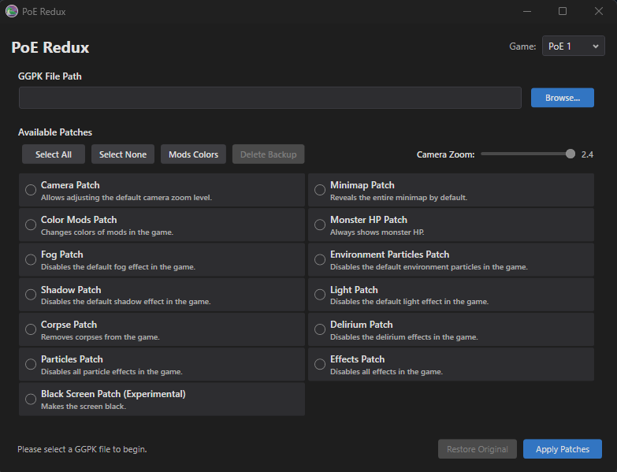

# PoeRedux



## Features

### PoE 1

- **Camera Patch**
  - Allows adjusting the default camera zoom level (1.2x to 2.4x)

- **Minimap Patch**
  - Reveals the entire minimap by default

- **Monster HP Patch**
  - Always shows monster HP bars

- **Color Mods Patch**
  - Changes colors of mods in the game

- **Fog Patch**
  - Disables the default fog effect in the game

- **Environment Particles Patch**
  - Disables the default environment particles in the game

- **Shadow Patch**
  - Disables the default shadow effect in the game

- **Light Patch**
  - Disables the default light effect in the game

- **Corpse Patch**
  - Removes corpses from the game

- **Delirium Patch**
  - Disables the delirium effects in the game

- **Particles Patch**
  - Disables all particle effects in the game

- **Effects Patch**
  - Disables all effects in the game

- **Black Screen Patch (Experimental)**
  - Makes the screen black

### PoE 2

- **Camera Patch**
  - Allows adjusting the default camera zoom level (1.2x to 2.4x)

- **Minimap Patch**
  - Reveals the entire minimap by default

- **Color Mods Patch**
  - Changes colors of mods in the game

- **Monster HP Patch**
  - Always shows monster HP bars

- **Atlas Fog Patch**
  - Removes fog from the Atlas

- **Fog Patch**
  - Disables the default fog effect in the game

- **Rain Patch**
  - Disables the default rain effect in the game

- **Clouds Patch**
  - Disables the default clouds effect in the game

- **Environment Particles Patch**
  - Disables the default environment particles in the game

- **Shadow Patch**
  - Disables the default shadow effect in the game

- **Light Patch**
  - Disables the default light effect in the game

- **Delirium Patch**
  - Disables the delirium effects in the game

- **Particles Patch**
  - Disables all particle effects in the game

- **Effects Patch**
  - Disables all effects in the game

- **Black Screen Patch (Experimental)**
  - Makes the screen black

## Installation

1. Go to the [Releases page](https://github.com/Gineticus/PoeRedux/releases)
2. Download the latest `PoeRedux-win-x64.exe`
3. Run the executable

**Note:** The application is self-contained and includes all required dependencies.

## Verifying Game Files

### For Standalone Client Users

1. Navigate to your Path of Exile install directory (e.g., `C:\Program Files (x86)\Grinding Gear Games\Path of Exile\`)
2. Right-click `PackCheck.exe` and select **Run as Administrator**

### For Steam Users

1. Right-click **Path of Exile** in your Steam Library
2. Select **Properties > Local Files > Verify Game Cache**

**Note:** File verification will restore original game files, removing any applied patches.

## Backups

Before any patch overwrites a game file, PoeRedux saves the original bytes to a local backup file. The **Restore Original** button in the app uses this backup to revert all changes for the currently selected game.

Backups are stored per game under your Windows Local AppData folder:

```
%LOCALAPPDATA%\PoeRedux\Backups\
    poe1.bak    (Path of Exile 1)
    poe2.bak    (Path of Exile 2)
```

**Note:** If you verify game files via PackCheck or Steam, the backup is no longer needed — you can safely delete the `.bak` file manually.

## System Requirements

- **Operating System:** Windows 10 version 2004 or later / Windows 11
- **Runtime:** .NET 10.0 Runtime (included in self-contained build)

## Support

For issues, suggestions, or contributions, please visit the [GitHub repository](https://github.com/Gineticus/PoeRedux).
